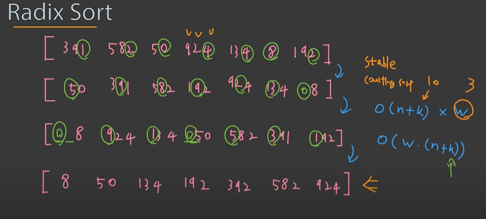

# Algorithm

## 정렬
### 거품 정렬 (Bubble)

- 장점
  - 간단한 구현
  - ~~경우에 따라 한번만 스왑하고 끝낼수 있음 ex) [2, 1, 3, 4, 5] - optimized version 적용시~~

- 단점
  - 순서에 맞지 않은 요소를 인접한 요소와 교환한다.
  - 하나의 요소가 가장 왼쪽에서 가장 오른쪽으로 이동하기 위해서는 배열에서 모든 다른 요소들과 교환되어야 한다.
  - 특히 특정 요소가 최종 정렬 위치에 이미 있는 경우라도 교환되는 일이 일어난다.
- 일반적으로 자료의 교환 작업(SWAP)이 자료의 이동 작업(MOVE)보다 더 복잡하기 때문에 버블 정렬은 단순성에도 불구하고 "거의 쓰이지 않는다."

### 선택 정렬 (Selection)

- 장점
  - 자료 이동 횟수가 미리 결정된다.
- 단점
  - 같은 값의 상대적인 위치가 변경될 수 있다. ex) [2, 1, 2, 1]

### 삽입 정렬 (Insertion)

- 장점
  - 안정한 정렬 방법
  - 레코드의 수가 적을 경우 알고리즘 자체가 매우 간단하므로 다른 복잡한 정렬 방법보다 유리할 수 있다.
  - '거의 정렬된' 상태라면 매우 효율적이다. ex) [2, 3, 4, 5, 6, 1]
- 단점
  - 비교적 많은 레코드들의 이동을 포함한다.
  - 레코드 수가 많고 레코드 크기가 클 경우에 적합하지 않다.

### 퀵 정렬 (Quick)

- 장점
  - 속도가 빠르다.
  - 시간 복잡도가 O(nlog₂n)를 가지는 다른 정렬 알고리즘과 비교했을 때도 가장 빠르다.
  - inplace로 구현할 시 메모리를 아낄 수 있다.(단, stable하지 않을 수 있음.)
  - 퀵 정렬은 O(log n)만큼의 메모리를 필요로 한다.
- 단점
  - 이미 정렬된 리스트에 대해서는 퀵 정렬의 불균형 분할에 의해 오히려 수행시간이 더 많이 걸린다.
- 퀵 정렬의 불균형 분할을 방지하기 위하여 피벗을 선택할 때 더욱 리스트를 균등하게 분할할 수 있는 데이터를 선택한다.
  - 리스트 내의 몇 개의 데이터 중에서 크기순으로 중간 값(medium)을 피벗으로 선택한다.
  - 무작위(random)로 pivot 고르기

### 병합 정렬 (Merge)

- 장점
  - 정확히 반절로 나누기에 최악의 경우에도 O(nlog₂n)보장함
    - 그러므로, 데이터의 분포에 영향을 덜 받는다.
- 단점
  - 기존의 데이터를 담을 추가적인 배열공간이 필요하다 -> 공간 복잡도 O(n)
    - 제자리 정렬(in-place sorting)이 아니다.
  - 레크드들의 크기가 큰 경우에는 이동 횟수가 많으므로 매우 큰 시간적 낭비를 초래한다.

### 힙 정렬 (Heap)
- 장점
  - 가장 큰 값 몇 개만 필요할 때 힙정렬 알고리즘이 유용하다.
  - 최악의 경우에도 시간 복잡도인 θ(nlogn)을 보장한다.
- 단점
  - 데이터들의 상태에 따라 다른 정렬법들에 비해서 조금 느린편이다.
  - 데이터의 순서가 바뀌는 unstable한 알고리즘이다.

### Quick sort vs Heap sort
- [Reference](https://stackoverflow.com/questions/2467751/quicksort-vs-heapsort)

### 기수 정렬 (Radix)

- Time Complexity: θ( w(n + k) ) -> θ(wn) 
- k = 기준으로 정한 k진수
- w = 주어진 list의 최대 자릿수
- n = 리스트의 길이
- 장점
  - 같은 두 수가 있어도 순서가 섞이지 않는 안정 정렬입니다.(Stable)

- 단점
  - 자릿수가 없는 것은 정렬할 수가 없습니다.(부동 소수점과 같은 것)
  - 중간 결과를 저장할 Bucket 공간이 필요합니다.
### 계수 정렬 (Counting)
- Time Complexity: θ(n + k), Space Complexity: θ(k) 
  - n = element 갯수, k = 범위
- **'범위조건'**이 있는 경우에 한해서 굉장히 빠르다.
  - 알파벳같이 문자가 26개로 제한된 경우에는 매우 효율적이다. 
- It is often used as a sub-routine to another sorting algorithm like radix sort.
- 구현 방법에 따라 stable하거나 unstable 하다

      구현 방법
      o 각 숫자의 갯수를 세준다.
    
      o 누적합 리스트를 생성함
        o 인덱스(off-set) 맞추기 위해 각 element값에 -1 해주기  
    
      o 최초에 전달받은 list를 뒤에서 부터 순회하면서 그 값을 누적합 리스트의 인덱스로 사용함
    
      o 누적합 리스트의 값이 최종 정렬될 리스트의 인덱스로 사용되고,
        그 인덱스에 순회할때 전달받은 값을 넣어주고 누적합 리스트의 값을 -1 해준다.

# Reference
- https://gmlwjd9405.github.io/tags.html#algorithm